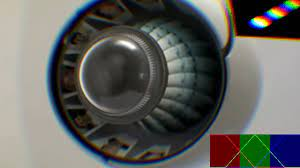
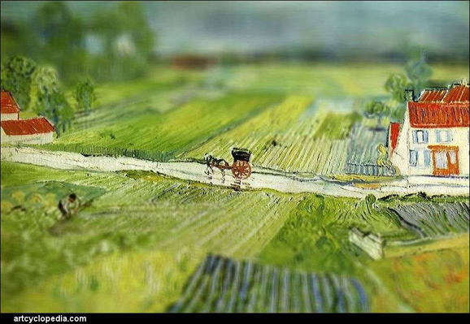

# WebGL Lib

A collection of utilities, shaders, and functions for use in WebGL projects.

## Installation

1. Ensure your NPM configuration has the correct keys to access @lcdigital scoped private packages.
1. `npm i @lcdigital/webgllib`

# Shaders

**Usage**

Shaders can be applied as ShaderPasses, and can be layered for multiple effects.

```typescript
import {barrelBlur} from '@lcdigital/webgllib';
import * as THREE from 'three';

const renderFBO = new THREE.WebGLRenderTarget(w, h, { format: THREE.RGBFormat });
const blurShader = new THREE.RawShaderMaterial(barrelBlur);
blurPass = new ShaderPass(renderer, blurShader, width, height, THREE.RGBFormat);
blurPass.shader.uniforms.tDiffuse.value = renderFBO.texture;
blurPass.shader.uniforms.amount.value = 0.2;
```

## **Barrel Blur**



**Description**

Applies a barrel distorion effect with chromatic aberration.

**Uniforms**
| Uniform         | Type     | Default      | Description                                          |
|-----------------|----------|--------------|------------------------------------------------------|
| tDiffuse        | Texture  | null         | The texture to render from                           |
| amount          | Float    | 0.5          | The intensity of the effect                          |
| invert          | Boolean  | false        | Whether to invert the effect, creating a fisheye look|
| time            | Float    | 0.0          | The current clock time                               |
| resolution      | Vector2  | [800.0, 600] | The resolution of the teture                         |

## **Color Correction**

**Description**
Applies basic contrast, staturation and brightness adjustments

**Uniforms**
| Uniform         | Type     | Default      | Description                                          |
|-----------------|----------|--------------|------------------------------------------------------|
| tDiffuse        | Texture  | null         | The texture to render from                           |
| brightness      | Float    | 0.0          | Brightness adjustment                                |
| contrast        | Float    | 0.0          | Contrast adjustment                                  |
| saturation      | Float    | 0.0          | Saturation adjustment                                |


## **Copy**

## **Grain**

**Description**

Adds a black grain effect

**Uniforms**
| Uniform         | Type     | Default      | Description                                          |
|-----------------|----------|--------------|------------------------------------------------------|
| tDiffuse        | Texture  | null         | The texture to render from                           |
| amount          | Float    | 0.15         | The amount of grain                                  |
| time            | Float    | 0.0          | The current clock time                               |

## **Grain Exp**

**Description**

Adds a high quality film grain effect using 3D noise. Computationally expensive.

**Uniforms**
| Uniform         | Type     | Default      | Description                                          |
|-----------------|----------|--------------|------------------------------------------------------|
| tDiffuse        | Texture  | null         | The texture to render from                           |
| amount          | Float    | 0.15         | The amount of grain                                  |
| scale           | Float    | 0.15         | The size of grain                                    |
| threshold       | Float    | 0.5          | The minimum brightness to show grain                 |
| speed           | Float    | 0.5          | The speed of grain movement                          |
| time            | Float    | 0.0          | The current clock time                               |

## **Grain Slow**

**Description**

Adds a slow changing film grain effect with blending.

**Uniforms**
| Uniform         | Type     | Default      | Description                                          |
|-----------------|----------|--------------|------------------------------------------------------|
| tDiffuse        | Texture  | null         | The texture to render from                           |
| amount          | Float    | 0.15         | The amount of grain                                  |
| threshold       | Float    | 0.5          | The minimum brightness to show grain                 |
| speed           | Float    | 0.5          | The speed of grain movement                          |
| time            | Float    | 0.0          | The current clock time                               |

## **RGB Noise**

## **RGB Shift**

## **Tilt Shift**



**Description**

Applies a tilt shift effect.

**Uniforms**
| Uniform         | Type     | Default      | Description                                          |
|-----------------|----------|--------------|------------------------------------------------------|
| tDiffuse        | Texture  | null         | The texture to render from                           |
| brightness      | Float    | 0.0          | Brightness adjustment                                |
| contrast        | Float    | 0.0          | Contrast adjustment                                  |
| saturation      | Float    | 0.0          | Saturation adjustment                                |

## **Vingette**

**Description**

Adds a vinette effect.

**Uniforms**
| Uniform         | Type     | Default      | Description                                          |
|-----------------|----------|--------------|------------------------------------------------------|
| tDiffuse        | Texture  | null         | The texture to render from                           |
| offset          | Float    | 1.0          | Center offset of the vinette                         |
| darkness        | Float    | 1.0          | How dark to make the vinette effect                  |

## **Vingette 2**

**Description**

Adds a vinette effect

**Uniforms**
| Uniform         | Type     | Default      | Description                                          |
|-----------------|----------|--------------|------------------------------------------------------|
| tDiffuse        | Texture  | null         | The texture to render from                           |
| feather         | Float    | 0.5          | Ammount of feather on the vinette edge               |
| roundness       | Float    | 0.5          | How round to make the vinett                         |
| inset           | Float    | 0.5          | Inset of the vinette                                 |
| brightness      | Float    | 0.0          | How bright to make the vinette effect                |

# Shader Libraries

## **Blend Modes**

## **Noise 3D**

## **Perlin Noise 3D**

# **Shader Pass**
